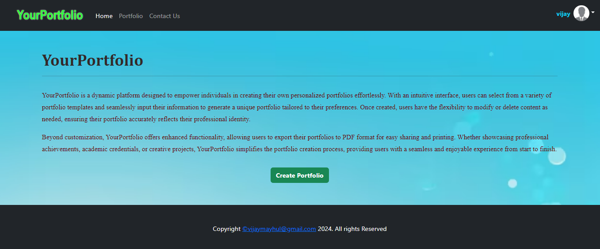

# Dynamic-Portfolio-Frontend

## Tech Stack

- HTML
- CSS
- Javascript
- Bootstrap
- React(axios, react-router-dom, Formik, Yup)

## Features

- Responsive and Interactive Design
- You can do CRUD operations in this website.
- Form Validation

## Lessons Learned

<b>Creating My Own Mock API</b>: 
- https://mockapi.io/ --> Through this website I created my own api which was used by me in this task.
- My Books API : https://65eed58eead08fa78a4f025d.mockapi.io/Books
- My Authors API : https://65eed58eead08fa78a4f025d.mockapi.io/authors
  
<b>Using Formik</b>: 
- I learned to use Formik third party library for form validation. I used it in 2 different ways like using Formik Tag and also using useFormik Hook.

<b>Using Yup</b>: 
- I learned to use Yup third party library to create validation schema in Formik, which helped me to create my own schema's in form validation.
 

## Website

[React-Formik-Task](https://vijay-react-formik-task.netlify.app/)

## Screenshots

## React + Vite

This template provides a minimal setup to get React working in Vite with HMR and some ESLint rules.

Currently, two official plugins are available:

- [@vitejs/plugin-react](https://github.com/vitejs/vite-plugin-react/blob/main/packages/plugin-react/README.md) uses [Babel](https://babeljs.io/) for Fast Refresh
- [@vitejs/plugin-react-swc](https://github.com/vitejs/vite-plugin-react-swc) uses [SWC](https://swc.rs/) for Fast Refresh

## Setup

Followig are the requirements to run this project:
- vite --> React Project Build Tool
- Node Package Manager (NPM)
- React

## npm run dev

Runs the app in the development mode.\
Open [http://localhost:3693](http://localhost:3693) to view it in your browser.

The page will reload when you make changes.\
You may also see any lint errors in the console.

## Feedback

If you have any feedback, please reach out to me at vijaymayhul@gmail.com

